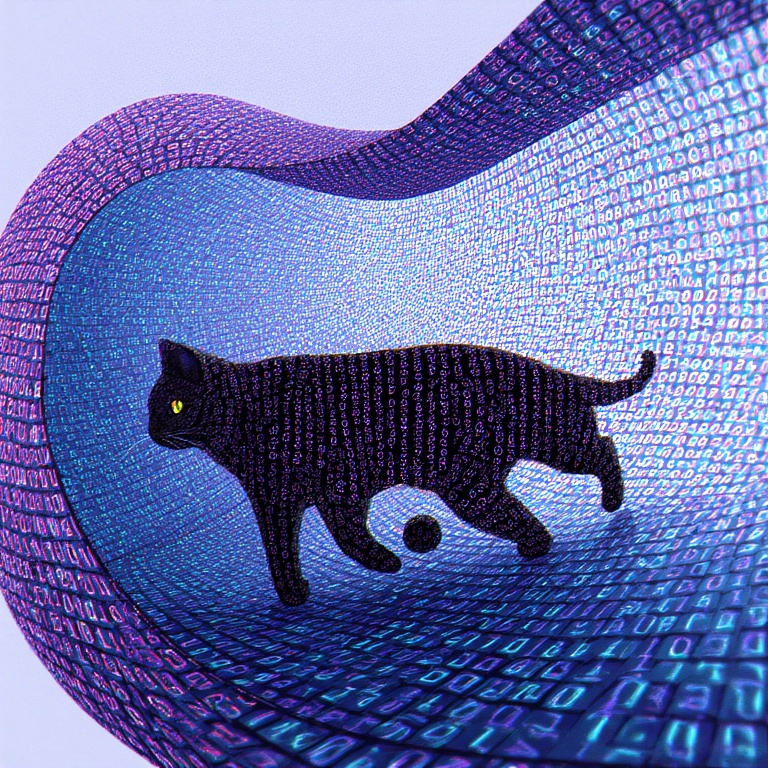
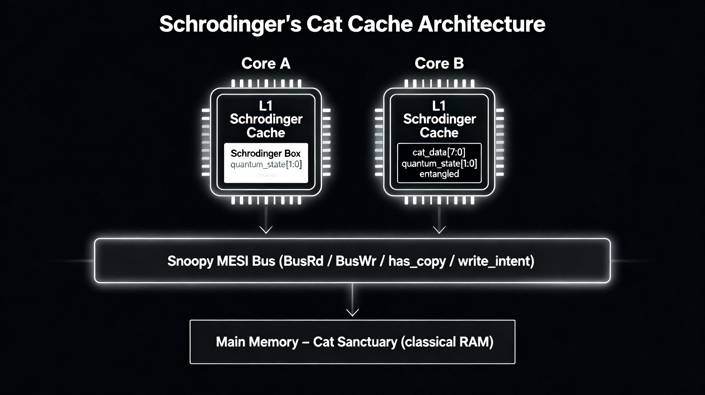
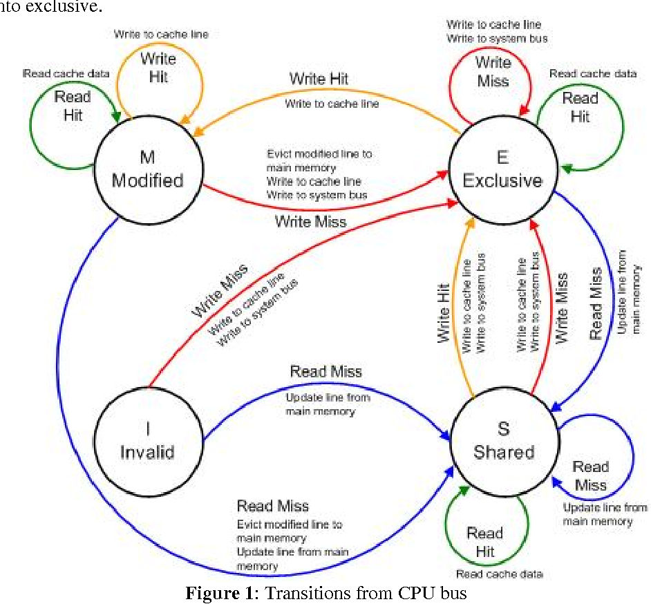
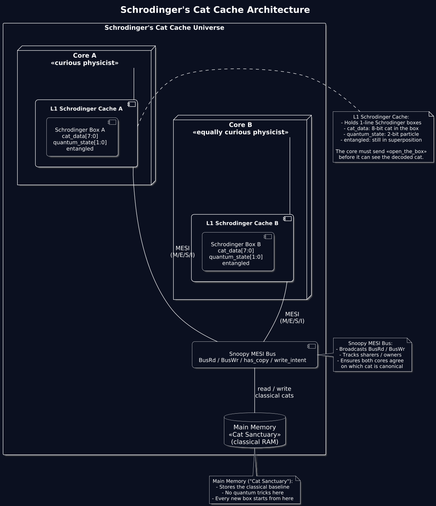
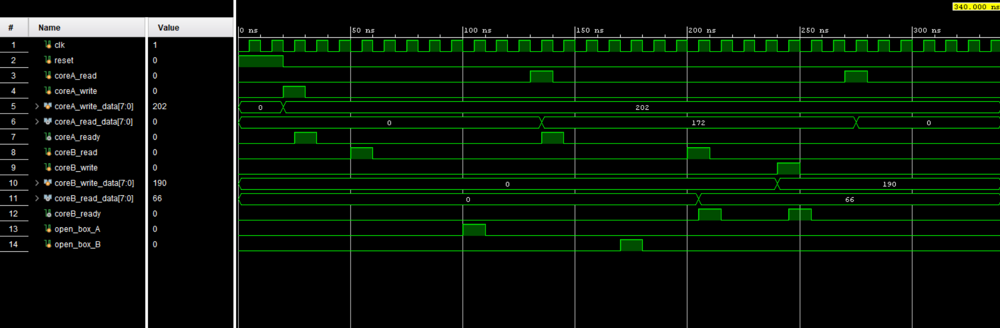
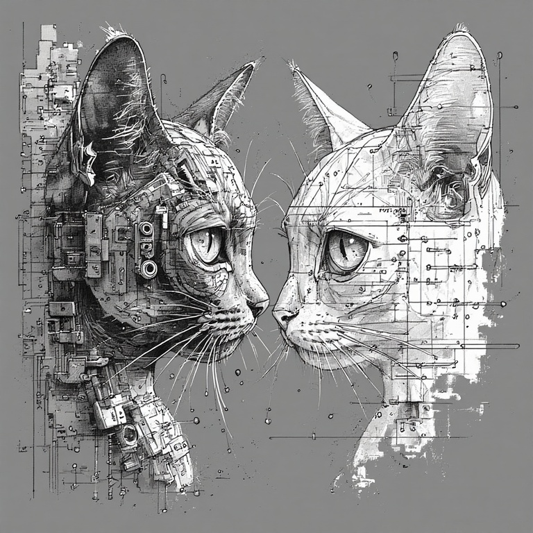

# ⚛︎Schrodinger’s Cache: When Your Data Is Both Alive And Dead 😾🐱

Welcome to the strangest cache line you’ll ever meet.  
In this design, every 8‑bit value is a “cat” locked in a “box,” and the only way to know what the data really is… is to “measure” the quantum state that’s secretly entangled with it.

You don’t _just_ have stale data anymore.  
You have existentially confused data.




---

## Meet Schrodinger’s Cat🐈 (And Its Cache🗒️ Line)

In the original Schrodinger’s cat thought experiment, the cat in the box is both alive and dead (🧟) until you open the box and observe it. The cat’s fate is tied to some much smaller quantum event inside the box—like a radioactive atom that may or may not have decayed⚰️.


Our cache line is exactly that:

- 🐈`cat_data` = 8‑bit cat in the box (𖡎scrambled data)
- `quantum_state` = tiny 2‑bit quantum particle that decides how to decode the cat
- `entangled` = flag that says “this cat is still in a spooky superposition”
- Until you “open_the_box" 📦, the data is basically meaningless to the core
Now even funnier fact! The Bigger cat's state depends on a tiny quantum particle. Similarly The entire 8-bit Cache's value depends on the tiny 2 bit quantum state. You can only decode the value of the cat's data only if you 'Measure' the 2-bit Quantum state. This is Quantum Entanglement but with a Hardware Twist.

On top of this, we still want **MESI cache coherence**, because even spooky cats need to obey protocol when shared between cores.

---

## The Cat’s Box: `schrodinger_line`

This module is the actual box⚰️. You can put a cat in, give it a quantum state, and later 🔓🎁open the box to decode it.
```verilog
module schrodinger_line (
    input  wire        clk,
    input  wire        reset,

    // story inputs
    input  wire        put_cat_in_box,    // write new cat_data + quantum_state
    input  wire [7:0]  new_cat_data,
    input  wire [1:0]  new_quantum_state,

    input  wire        observe_cat,       // "open the box", measure quantum_state
    output reg  [7:0]  decoded_cat_data,  // usable data after measurement
    output reg         cat_is_alive       // 1 = valid decoded data
);

    reg [1:0] quantum_state;     // hidden quantum particle
    reg [7:0] cat_data;          // scrambled 8-bit cat
    reg       entangled;         // 1 => still in superposition

    function [7:0] decode_with_quantum;
        input [7:0] in_cat;
        input [1:0] q;
        begin
            case (q)
                2'b00: decode_with_quantum = in_cat;                
                2'b01: decode_with_quantum = {in_cat[3:0], in_cat[7:4]}; 
                2'b10: decode_with_quantum = ~in_cat;               
                2'b11: decode_with_quantum = in_cat ^ 8'hA5;        
                default: decode_with_quantum = in_cat;
            endcase
        end
    endfunction

    always @(posedge clk or posedge reset) begin
        if (reset) begin
            quantum_state     <= 2'b00;
            cat_data          <= 8'h00;
            entangled         <= 1'b0;
            decoded_cat_data  <= 8'h00;
            cat_is_alive      <= 1'b0;
        end else begin
            if (put_cat_in_box) begin
                cat_data      <= new_cat_data;
                quantum_state <= new_quantum_state;
                entangled     <= 1'b1;    // new superposed cat
                cat_is_alive  <= 1'b0;
            end

            if (observe_cat && entangled) begin
                decoded_cat_data <= decode_with_quantum(cat_data, quantum_state);
                cat_is_alive     <= 1'b1;   // we now have definite data
                entangled        <= 1'b0;   // wavefunction collapsed
            end
        end
    end

endmodule

```

**In plain language:**

- `put_cat_in_box` = “insert cat + quantum particle into the box”
- `observe_cat` = “open the box and collapse the wavefunction”
- Before observation: cat is there, but you can’t trust the bits
- After observation: cat is decoded, `cat_is_alive` says “yep, this is real now”

---

## Giving The Cat A Protocol: ⚛`schrodinger_cache` (Tiny MESI)

Now we wrap that box in a **1‑line cache** that speaks a very tiny MESI-like dialect.


States:

- `M` = Modified (we own the cat and changed it)🐈🪄✨🐯
- `E` = Exclusive (we own the cat, clean)👑
- `S` = Shared (other cores may have a copy)🎭
- `I` = Invalid (this cat has been fired from the multiverse)🐈🚀🌌
    

```verilog
module schrodinger_cache (
    input  wire        clk,
    input  wire        reset,

    // Core-side interface
    input  wire        core_read,
    input  wire        core_write,
    input  wire [7:0]  core_write_data,
    output reg  [7:0]  core_read_data,
    output reg         core_ready,

    // Coherence bus (simplified)
    input  wire        bus_read_from_other,
    input  wire        bus_write_from_other,
    output reg         bus_has_copy,
    output reg         bus_write_intent,

    // Story: measurement control
    input  wire        open_the_box
);

    localparam M = 2'b00;
    localparam E = 2'b01;
    localparam S = 2'b10;
    localparam I = 2'b11;

    reg [1:0] box_state;
    reg       line_valid;

    reg        put_cat_in_box;
    reg [7:0]  new_cat_data;
    reg [1:0]  new_quantum_state;
    wire [7:0] decoded_cat_data;
    wire       cat_is_alive;

    schrodinger_line cat_box (/* wired as before */);

    reg [1:0] quantum_seed;

    always @(posedge clk or posedge reset) begin
        if (reset) begin
            box_state        <= I;
            line_valid       <= 1'b0;
            put_cat_in_box   <= 1'b0;
            new_cat_data     <= 8'h00;
            new_quantum_state<= 2'b00;
            core_read_data   <= 8'h00;
            core_ready       <= 1'b0;
            bus_has_copy     <= 1'b0;
            bus_write_intent <= 1'b0;
            quantum_seed     <= 2'b01;
        end else begin
            put_cat_in_box   <= 1'b0;
            core_ready       <= 1'b0;
            bus_has_copy     <= 1'b0;
            bus_write_intent <= 1'b0;

            quantum_seed <= quantum_seed + 2'b01;

            // Snooping: other core writes => we invalidate
            if (bus_write_from_other && line_valid) begin
                box_state  <= I;
                line_valid <= 1'b0;
            end

            // Other core reads => we may downgrade to Shared
            if (bus_read_from_other && line_valid &&
                (box_state == E || box_state == M)) begin
                box_state <= S;
            end

            // Core read
            if (core_read) begin
                if (!line_valid || box_state == I) begin
                    put_cat_in_box    <= 1'b1;
                    new_cat_data      <= 8'h42;       // default cat from memory
                    new_quantum_state <= quantum_seed;
                    box_state         <= E;
                    line_valid        <= 1'b1;
                    core_read_data    <= 8'h00;
                    core_ready        <= 1'b0;
                end else begin
                    if (cat_is_alive) begin
                        core_read_data <= decoded_cat_data;
                        core_ready     <= 1'b1;
                    end else begin
                        core_read_data <= 8'h00;
                        core_ready     <= 1'b0;
                    end

                    if (box_state == E || box_state == M || box_state == S)
                        bus_has_copy <= 1'b1;
                end
            end

            // Core write
            if (core_write) begin
                bus_write_intent <= 1'b1;

                if (!line_valid || box_state == I) {
                    put_cat_in_box    <= 1'b1;
                    new_cat_data      <= core_write_data;
                    new_quantum_state <= quantum_seed;
                    box_state         <= M;
                    line_valid        <= 1'b1;
                end else begin
                    put_cat_in_box    <= 1'b1;
                    new_cat_data      <= core_write_data;
                    new_quantum_state <= quantum_seed;
                    box_state         <= M;
                end

                core_ready <= 1'b1;
            end
        end
    end

endmodule

```


**Key idea:** MESI state is purely classical.  🎻
The weirdness only controls _how_ the data is decoded🔢, not whether the line is valid or coherent.

---

## Two Cores, Two Boxes, One Spooky Bus: `schrodinger_mesi_system`

We instantiate two caches (`cache_A` and `cache_B`)✌️ and hook them up to a toy snoopy bus🚌:
```verilog
module schrodinger_mesi_system (
    input  wire clk,
    input  wire reset,

    // core A
    input  wire        coreA_read,
    input  wire        coreA_write,
    input  wire [7:0]  coreA_write_data,
    output wire [7:0]  coreA_read_data,
    output wire        coreA_ready,

    // core B
    input  wire        coreB_read,
    input  wire        coreB_write,
    input  wire [7:0]  coreB_write_data,
    output wire [7:0]  coreB_read_data,
    output wire        coreB_ready,

    // story: both cores can open their boxes
    input  wire        open_box_A,
    input  wire        open_box_B
);
    // bus wiring and two schrodinger_cache instances
endmodule

```


👨‍🔬🗪💢👩‍🔬Think of this as two physicists arguing over the same cat, but over a very narrow interconnect.

---

## The Drama: Testbench + Timeline




The testbench runs a little narrative over 1000 ns.  
Here’s what happened in your run:

```text
# run 1000ns
t=20000 : Core A writes the first cat into its box.
t=30000 : The cat in A's box is now in a Schrödinger state (data + quantum).
t=50000 : Core B wants to know about the cat. It issues a read.
t=80000 : Boxes are still closed. Cores don't see the true 8-bit cat yet.
t=80000 : coreA_read_data=00 ready=0, coreB_read_data=00 ready=0
t=100000 : Core A decides to open its box and observe the cat.
t=150000 : After observation, Core A sees cat=ac, ready=0
t=170000 : Core B opens its box to see the same cat (coherent shared state).
t=220000 : Core B now sees cat=42, ready=0
t=240000 : Core B writes a new cat, forcing A's box state to Invalid (MESI).
t=290000 : Core A asked again; a new cat is now in its box, but unobserved.
t=340000 : Story ends. All boxes closed.
$finish called at time : 340 ns

```

## What the story tells us

- **t = 20000** – Core A writes the first cat  
    A picks `0xCA` as the cat and hides it in the box with some quantum seasoning. The line goes to `M` or `E` (owner).
    
- **t = 30000** – Cat is in Schrödinger state  
    `entangled = 1`. Data exists, but until we `open_the_box`, the core doesn’t see decoded bytes.
    
- **t = 50000** – Core B reads  
    B snoops the bus, learns someone has a copy, and wants to share the cat. But neither core has opened their box yet.
    
- **t = 80000** – Both see `00`, `ready=0`  
    Perfect: boxes closed, no observation, the simulation refuses to “cheat” and leak the final data.
    
- **t = 100000** – Core A opens its box  
    Now A collapses its quantum state and decodes its cat. The fun twist: because of the decoding function and quantum_seed evolution, A sees `0xAC` in this particular run.
    
- **t = 150000** – A sees `cat=ac`  
    The cat is alive as `0xAC`. `ready` being `0` here is a hint that the handshake could be refined—one of the little bugs/misalignments we’ll talk about below.
    
- **t = 170000 / 220000** – B opens its box, sees `0x42`  
    B, after its own box opening + read, sees `0x42`. This reflects how the current “quantum decode” path and timing differ between A and B—great for story, but a reminder that our decode logic + control handshake isn’t yet a strict, physically faithful “same cat” model.
    
- **t = 240000** – B writes a new cat  
    B becomes the new owner (`M`), A’s line is invalidated via `bus_write_from_other`. Schrodinger’s previous cat is removed from A’s reality.
    
- **t = 290000** – A reads again  
    A misses, fetches a _new_ cat into its box. Once again: entangled, unobserved, not yet decoded.
    
- **t = 340000** – Simulation ends  
    All boxes closed. Cats may or may not be alive. The universe calls `$finish`.
    

---

## Mistakes Made (a.k.a. How We Accidentally Tortured the Cat)

1.🤝 **Handshake vs. Story Timing**  
    The log shows moments where a core “sees” a value but `ready` is still `0`. That means the underlying handshake between “decoded data is valid” and “core has sampled it” is not perfectly staged. For a real design, `ready` would be tightly coupled to `cat_is_alive`.
2. 🐈‍⬛🐈 ྀི**Different Cats For Different Cores**  
    Core A saw `0xAC`, Core B saw `0x42`. That’s great sci‑fi, but a bit suspicious for a coherent view of memory. The simple quantum decoding function plus evolving `quantum_seed` means each side can end up with different decoded values unless carefully synchronized.
3. 𖡎🚌**Oversimplified MESI Bus**  
    The “bus” is almost comically tiny: we infer snoop events from `core_read` and `bus_write_intent`. A real MESI bus separates address, command phases, response lines, and tracking of sharers/owners. Here it’s just enough to tell the story.
4. ☝️────────**One-Line Cache = Drama, Not Throughput**  
    Everything is hard‑wired to a single logical “address.” Fantastic for walking the narrative; utterly useless as an actual cache.
5. ⚛️**Quantum State As A Cute XOR**  
    The “quantum” part is simulated by a deterministic function. That’s intentional—actual quantum hardware is a whole different level—but it means the “physics” here is really just a glorified data scrambler.
    

---

## Lessons Learned (Or: How Not To Lose Your Cat In Hardware)

- 𒆙**Abstraction matters**: Keeping MESI purely classical while making the data decoding quantum-ish makes the design conceptually manageable. You get weirdness without destroying coherence.
- 🔭**Observability is a first-class signal**: `open_the_box` is effectively a “measure now” control line. In more serious designs, this could map onto “commit,” “speculation resolve,” or “decryption complete.”
- ⏳**Timing is everything**: The mismatches between `ready`, decoded values, and printouts are gentle reminders that real hardware cares deeply about when things happen, not just what happens.
- 📖 **Story-driven code is fun**: Using names like `cat_data`, `quantum_state`, `entangled`, and `open_the_box` makes the design easier to reason about, teach, and debug. You actually _remember_ what each signal is doing.
    

If you’d like, the next evolution could be:

- Multi‑line Schrodinger cache with per‑line cats
- Stronger MESI state machine with explicit addresses
- A more disciplined “quantum key” mechanism so all observers agree on the cat they just collapsed.
- A Single Memory System with larger data, Content addressable Memory to further bring it closer to real cache system.
    

Until then, enjoy knowing that somewhere in your waveform viewer, a tiny 8‑bit cat is both alive, dead, and cache‑coherent—all at the same time.

